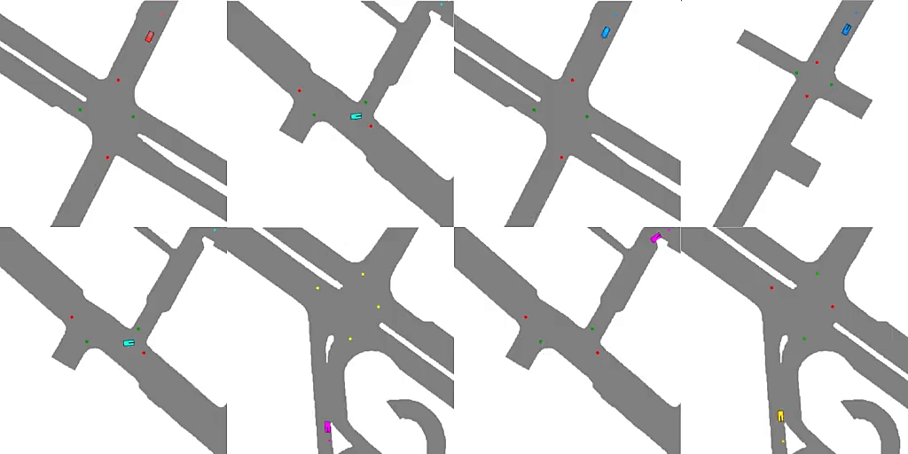

<div align="center">

# Social Driving

**Emergent Road Rules In Multi-Agent Driving Environments**

[](https://www.repostatus.org/#active)
[](LICENSE)
[](https://avikpal.gitbook.io/social-driving/)
[](https://badge.fury.io/py/sdriving)
[](https://arxiv.org/abs/2011.10753)
[](https://hits.seeyoufarm.com)



<br>

<p style="text-align: justify;">
For autonomous vehicles to safely share the road with human drivers, autonomous vehicles must abide by specific "road rules" that human drivers have agreed to follow. "Road rules" include rules that drivers are required to follow by law -- such as the requirement that vehicles stop at red lights -- as well as more subtle social rules -- such as the implicit designation of fast lanes on the highway. In this paper, we provide empirical evidence that suggests that -- instead of hard-coding road rules into self-driving algorithms -- a scalable alternative may be to design multi-agent environments in which road rules emerge as optimal solutions to the problem of maximizing traffic flow. We analyze what ingredients in driving environments cause the emergence of these road rules and find that two crucial factors are noisy perception and agents' spatial density. We provide qualitative and quantitative evidence of the emergence of seven social driving behaviors, ranging from obeying traffic signals to following lanes, all of which emerge from training agents to drive quickly to destinations without colliding. Our results add empirical support for the social road rules that countries worldwide have agreed on for safe, efficient driving. 
</p>

</div>


<!-- [](https://pepy.tech/project/sdriving)
[](https://pepy.tech/project/sdriving/month)
[](https://pepy.tech/project/sdriving/week) -->

## Installation

Stable Release version is available through pip

```
pip install sdriving
```

Alternatively you can install using the latest (unreleased) version using
```
pip install git+https://github.com/fidler-lab/social-driving.git
```


## Nuscenes Maps

Preprocessed [nuScenes Maps](https://www.nuscenes.org/) are provided with the tagged release of this software. If you use these maps in your research consider citing the [nuScenes Paper](https://arxiv.org/abs/1903.11027).

## Questions/Requests

Please file an issue if you have any questions or requests about the code or the paper. If you prefer your question to be private, you can alternatively email me at avikpal@cse.iitk.ac.in.

## Citation

If you found this codebase useful in your research, please consider citing

```
@misc{pal2020emergent,
    title={Emergent Road Rules In Multi-Agent Driving Environments}, 
    author={Avik Pal and Jonah Philion and Yuan-Hong Liao and Sanja Fidler},
    year={2020},
    eprint={2011.10753},
    archivePrefix={arXiv},
    primaryClass={cs.LG}
}
```
